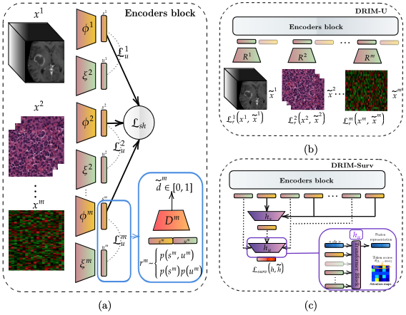

# DRIM: Learning Disentangled Representations from Incomplete Multimodal Healthcare Data

This is the code associated to the paper **DRIM: Learning Disentangled Representations from Incomplete Multimodal Healthcare Data** (accepted to [MICCAI2024](https://conferences.miccai.org/2024/en/)).

__________________
# Data Preprocessing

Navigate to the `data` folder to deal with the download and the preprocessing of the data.
The maximum file size limit of the supplemental does not allow the WSI pre-trained models to be supplied. So only the MRI pre-trained model is provided in `data/models/`.

**N.B**: The data used is from the TCGA-GBMLGG and must have the following structure:

```
├── GBMLGG
│   ├── MRI
│   ├── WSI
│   ├── DNAm
│   ├── RNA
```
Also in the `data` folder you must have, for each sample a `files/train_brain.csv` and a `files/test_brain.csv` containing for each modality, the path through the corresponding file. But again, check the `README.md` from the `data` folder for further explanations.

________
# Quickstart
Start by creating a dedicated conda environment and installing all the required packages
```
$ conda create python=3.10.10 --name drim
$ conda activate drim
$ pip install -r requirements.txt
```
**N.B:** This repository relies on [Hydra](https://hydra.cc/docs/intro/) to run experiments and benefits from all the advantages it offers (*multiruns, sweeps, flexibility...*)

________
# Training loops
Here are a number of scripts for training and cross-validation.

**Unimodal**
<br>
For example, to launch a unimodal training session on each of the modalities, using Hydra's features, you can enter the following in the CLI:
```
$ python train_unimodal.py -m general.modalities=DNAm,WSI,RNA,MRI
```

**Simple Multimodal**
<br>
To use a simple fusion architecture, having the choice for each of $h_u$ and $h_s$
```
$ python train_vanilla_multimodal.py fusion.name=maf
```
But once again, to use all the possible functions
```
$ python train_vanilla_multimodal.py -m fusion.name=mean,concat,masked_mean,tensor,sum,max,maf
```

**Auxiliary Multimodal**
<br>
In this repository, in addition to the fusion, you can add a cost function to the $s_i^m$ representations. This can be either the cost function used in DRIM directly adapted from the Supervised Contrastive loss function (1) or the MMO loss function (2) which tends to orthogonalise the representations.
$$
\mathcal{L}_{sh} = \frac{1}{N\cdot M} \sum_{j \in J} \frac{-1}{M - 1} \sum_{b \in B(j)} \log \frac{exp(s_j\cdot s_b /\tau)}{\sum_{\substack{k \in J \\ k\neq j}} exp (s_j\cdot s_k / \tau)} \; \; \; (1)
$$
or 
$$\mathcal{L}_{sh} = \frac{1}{N\cdot M} \sum_{m = 1}^M \max(1, \|s^m\|_*) - \|S\|_* \; \; \; (2)$$
(see the paper for more details on the notations.)
```
$ python train_aux_multimodal.py aux_loss.name=contrastive
```
```
$ python train_aux_multimodal.py aux_loss.name=mmo aux_loss.alpha=0.5
```
## DRIM
The DRIM method is very flexible and can be adapted to any type of task. For example, we offer two alternatives DRIMSurv and DRIMU.
<br>
<br>
**DRIMSurv**
<br>
DRIMSurv enables end-to-end training of a survival model by training the encoders at the same time as the higher attention blocks needed to merge the various representations $\{s^m\}_{m=1}^M$ and $\{u^m\}_{m=1}^M$. (Fig 1c.)
```
$ python train_drimsurv.py
```

**DRIMU**
<br>
The other alternative DRIMU does not require a label and is trained using a reconstruction scheme. The code provided allows the backbone encoders to be pre-trained and then frozen for finetuning over 10 epochs on a survival task with a fusion scheme similar to DRIMSurv. (Fig 1b.)
```
$ python train_drimu.py
```

## Robustness
Once each model has been trained on the 5 splits, it is possible to test how they perform and how robust they are to different combinations of input modalities. Simply run the `robustness.py` script, which is based on the `configs/robustness.yaml` configuration file, and look at the output CS score performance.
To check all available methods:
```
$ python robustness -m method=drim,max,tensor,concat
```

## Stratifying high-risk vs low-risk patients
All the code related to this stratisfication as well as the results of the logrank test can be found in the notebook `clustering.ipynb`

________
# Logging
All the training sessions have been logged on Weights and Biases. You can also use [Weights and Biases](https://wandb.ai/) to track the progress of your runs. To do this, add your project and entity to the configuration files `configs/unimodal.yaml` and `configs/multimodal.yaml`:

```
wandb:
    entity: MyAwesomeNickname
    project: MyAwesomeProject
````
Otherwise, training progression and evaluation will be displayed directly in the console.